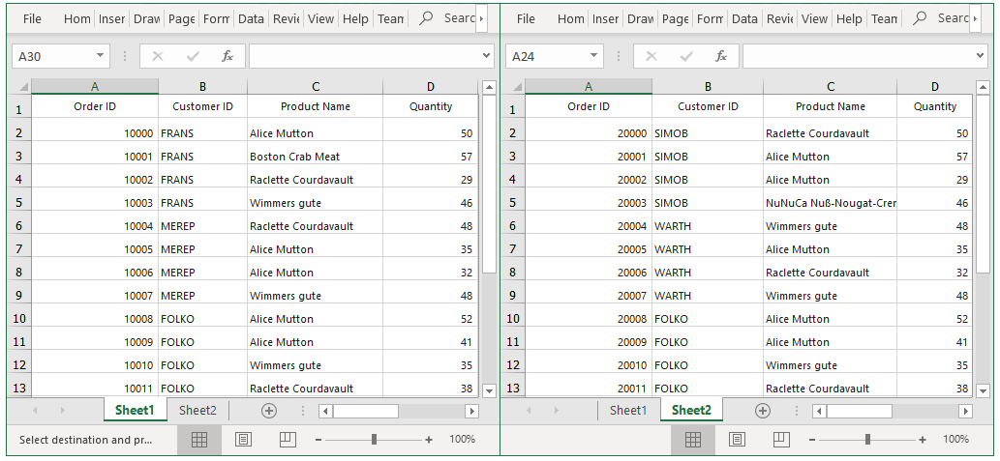

# How to export the multiple WinForms DataGrid's (SfDataGrid's) into multiple worksheet in Excel?

## About the sample

This sample illustrates how to export the data from multiple SfDataGrid's to different worksheets in a same excel workbook.

In SfDataGrid, you can export the data to Excel by using the ExportToExcel method. 
You can also export the data from multiple SfDataGrid to different worksheets in a same workbook by passing the worksheet to which the data need to be exported as a parameter for the ExportToExcel method.

```c#
using Syncfusion.WinForms.DataGridConverter;
using Syncfusion.XlsIO;
private void OnExportButton_Click(object sender, EventArgs e)
{
    var options = new ExcelExportingOptions();
    ExcelEngine excelEngine = new ExcelEngine();
    IWorkbook workBook = excelEngine.Excel.Workbooks.Create();

    sfDataGrid1.ExportToExcel(sfDataGrid1.View, options, workBook.Worksheets[0]);
    sfDataGrid2.ExportToExcel(sfDataGrid2.View, options, workBook.Worksheets[1]);
    workBook.Version = ExcelVersion.Excel2013;
   
    // Saving the workbook.
    workBook.SaveAs("sample.xlsx");
    }
}
```



## Requirements to run the demo
Visual Studio 2015 and above versions
